# Online-CV-Resume
Beautiful Online CV Resume Collections Based On Asp.Net Core 2.2. Azure online demo available. 
original HTML version can be download from [Colorlib](https://colorlib.com)
support by [CodeRush.CO] source code collections (https://coderush.co)

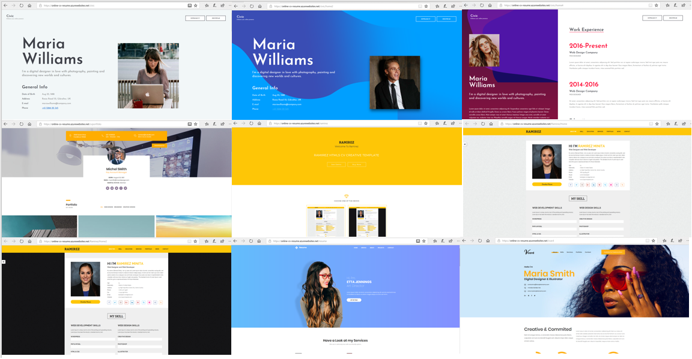

1. experience the azure online [demo](https://online-cv-resume.azurewebsites.net/civic)
2. experience the azure online [demo](https://online-cv-resume.azurewebsites.net/civic/home2)
3. experience the azure online [demo](https://online-cv-resume.azurewebsites.net/civic/home3)
4. experience the azure online [demo](https://online-cv-resume.azurewebsites.net/civic/home4)
5. experience the azure online [demo](https://online-cv-resume.azurewebsites.net/civic/home5)
6. experience the azure online [demo](https://online-cv-resume.azurewebsites.net/civic/home6)
7. experience the azure online [demo](https://online-cv-resume.azurewebsites.net/cvportfolio)
8. experience the azure online [demo](https://online-cv-resume.azurewebsites.net/ramirez)
9. experience the azure online [demo](https://online-cv-resume.azurewebsites.net/Ramirez/Home)
10. experience the azure online [demo](https://online-cv-resume.azurewebsites.net/Ramirez/Home2)
11. experience the azure online [demo](https://online-cv-resume.azurewebsites.net/resume)
12. experience the azure online [demo](https://online-cv-resume.azurewebsites.net/vcard)

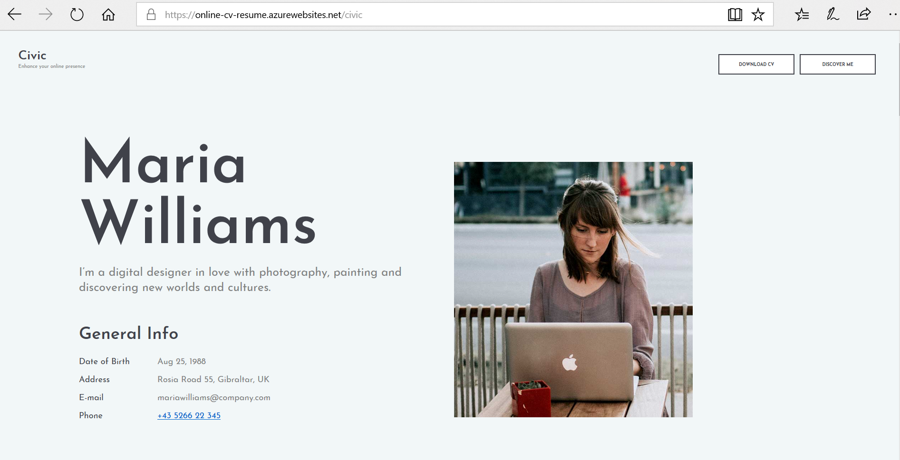
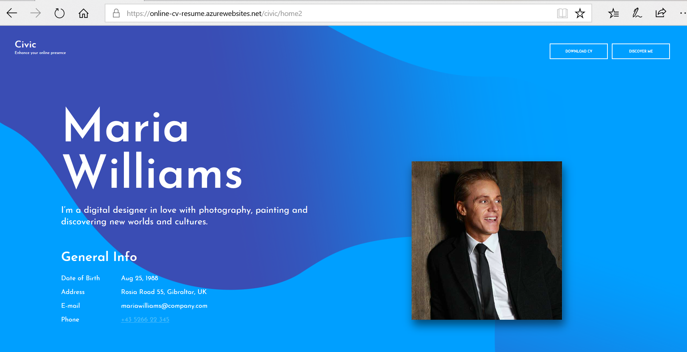
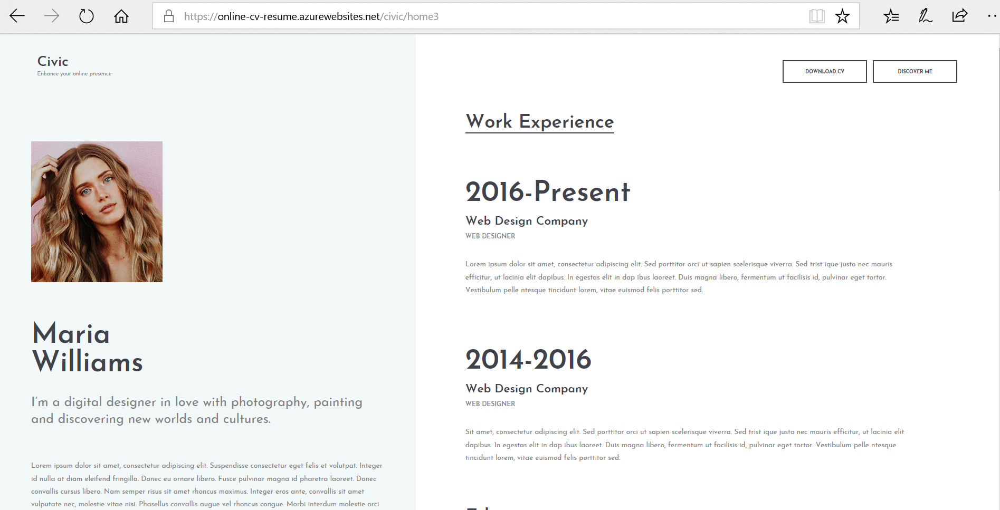
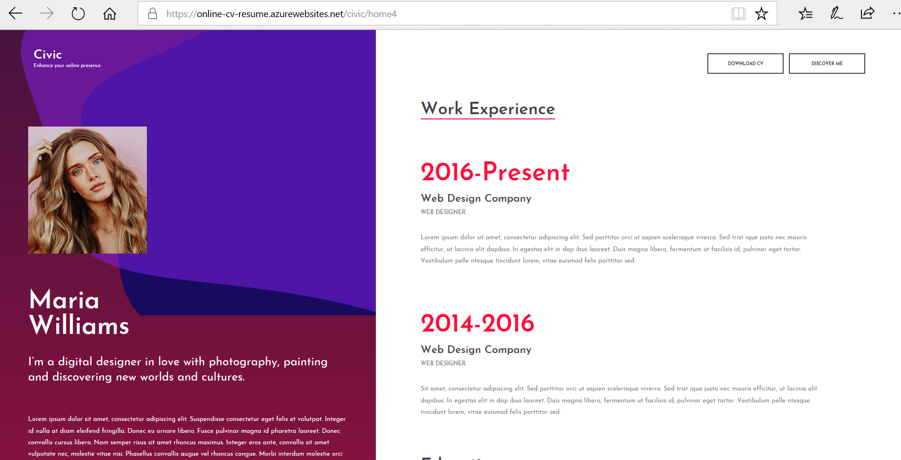
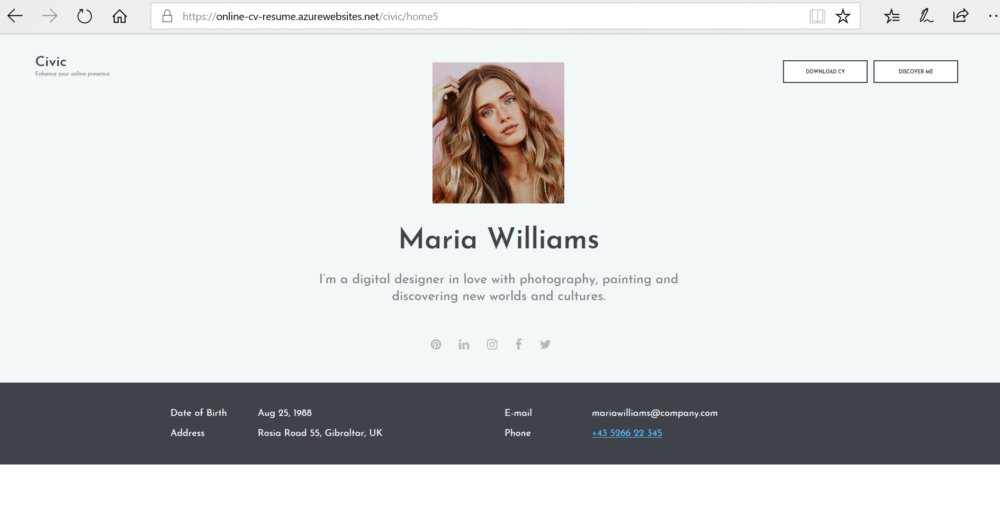
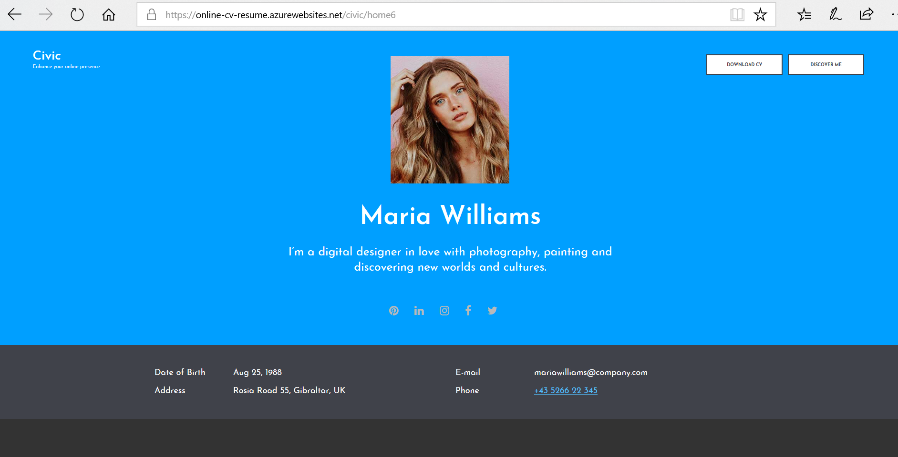
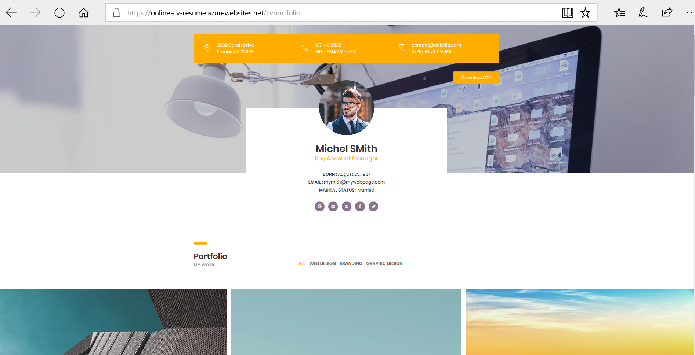
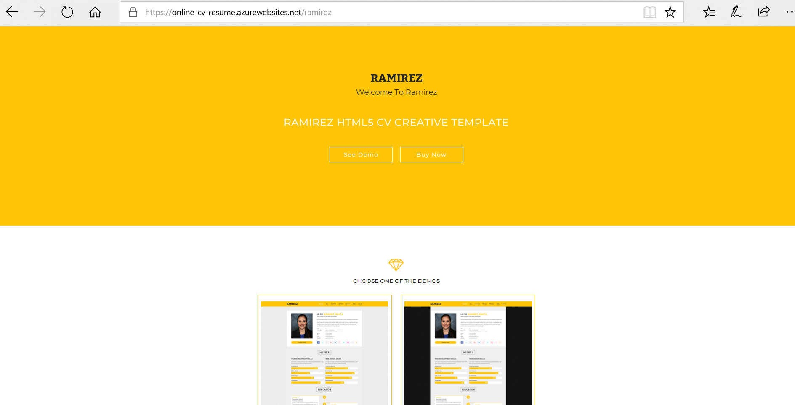

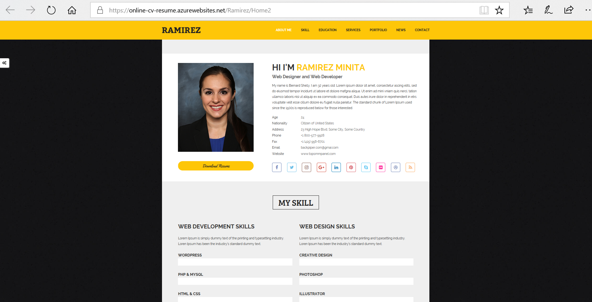
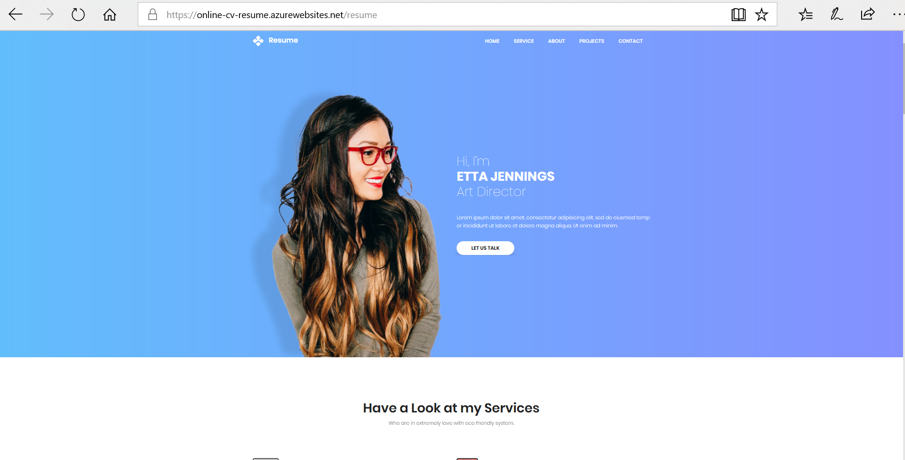

# Development Tools & Environment

I'm using **Visual Studio Community 2017** for the development tools on Windows 10 machine.

# .Net Core Version

I'm using **.Net Core 2.2**

# Supported by CodeRush.Co
[CodeRush.CO] source code collections (https://coderush.co) lot of open source cool apps there. 50% Off All Products, Use Discount Code **GITHUB50**

